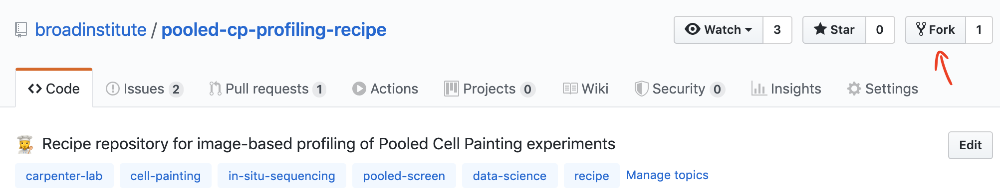

# Setup

There are two setup steps that need to be performed **only once** before starting your first project.

## Step 1: Initialize the computational environment

After setting up your very first repository using our template, navigate into the top level directory of the newly cloned repo.
(For instructions on how to setup a new repository, see [WELD.md](WELD.md#step-1-create-a-new-repository-using-this-repository-as-a-template))

```bash
NEW_REPO="INSERT_REPO_NAME_HERE"
cd $NEW_REPO
```

Install [conda](https://docs.conda.io/projects/conda/en/latest/user-guide/install/).  
We use conda as an environment manager.

```bash
# Install computational environment
conda env create --force --file environment.yml

# Initialize the environment
conda activate pooled-cell-painting
```

## Step 2: Fork the Pooled Cell Painting Painting recipe

We need to [fork](https://help.github.com/en/github/getting-started-with-github/fork-a-repo) the official pooled cell profiling recipe located at https://github.com/broadinstitute/pooled-cp-profiling-recipe.

### Procedure:

See [forking instructions](https://help.github.com/en/github/getting-started-with-github/fork-a-repo) and the image below.



### Result:

The fork creates a copy of a recipe repository.  

### Goals:

1. Remove the connection to the official recipe updates to avoid unintended weld versioning reversal.  
2. Enable independent updates to fork code that does not impact official recipe.  

## Next steps and more details

* For a general overview of the pipeline welding process, see the [repo README](README.md).  
* For the welding process steps to perform with each dataset, see the [weld process README](WELD.md).
