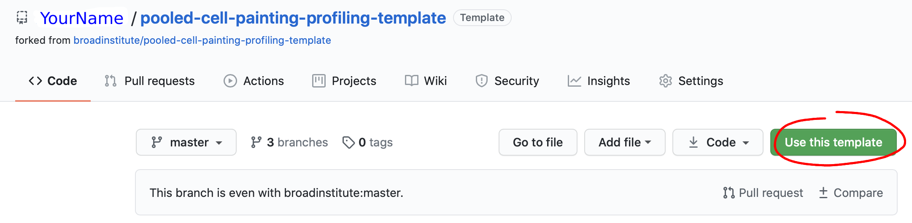
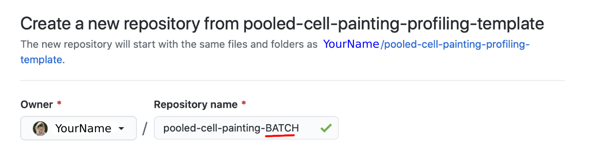

# Weld

Below are steps required to initialize and perform data pipeline welding for your favorite batch of pooled cell painting data.
Make sure that you have performed the steps in [SETUP.md](SETUP.md) before performing your weld.


## Step 1: Create a new repository **using this repository as a template**

### Procedure:

Click "Use this template".



Enter a name for your new repository that includes your batch name and click "Create repository from template".



Now, fork and clone the forked repository to your favorite file system (local, AWS, GCP, etc.).

### Result:

A repository for each batch of pooled cell painting data.

### Goal:

1. Retain all code, configuration files, computational environments, and directory structure that a standard pooled cell painting workflow expects and produces.

## Step 2: Create a submodule of the forked recipe inside the new repository

Next, we create a [submodule](https://gist.github.com/gitaarik/8735255) in the repository we just created.

### Procedure:

See below:

```bash
# In your terminal, clone the repository you just created (THIS REPO)
USER="INSERT-USERNAME-HERE"
REPO="INSERT-NAME-HERE"
git clone git@github.com:$USER/$REPO.git

# Navigate to this directory
cd $REPO

# Add the recipe submodule
git submodule add git@github.com:$USER/pooled-cell-painting-profiling-recipe.git recipe
```

Refer to ["Adding a submodule"](https://gist.github.com/gitaarik/8735255#adding-a-submodule) for more details.

### Result:

Adding a submodule initiates the weld.  

### Goals:

1. Link the processing code (recipe) with the data (current repo).  
2. Require a manual step to update the recipe to enable asynchronous development.

## Step 3: Commit the Submodule

Lastly, we [commit](https://help.github.com/en/desktop/contributing-to-projects/committing-and-reviewing-changes-to-your-project#about-commits) the submodule to github.

### Procedure:

See below:

```bash
# Add, commit, and push the submodule contents
git add .gitmodules recipe
git commit -m 'link recipe submodule to initialize weld'
git push
```

### Result:

Committing this change finalizes the weld initialization.

### Goal:

1. Track the submodule (recipe) version with the current repository.

## Step 4: Perform the weld

### Procedure:

1. Activate conda environment. (`conda activate pooled-cell-painting`)
2. Manually update the configuration yaml documents for your specific batch.
    * Yaml documents with reasonable default values are available in the [config/](config/) folder.  
    * Do NOT change the location of the .yaml files.  
    * Additional documentation for each of the parameters is available in the [config/docs/](config/docs/) folder.  
3. Execute `weld.py` (see below)

```
python weld.py
```

### Result:

* Produce quality control figures and summary statistics for all sites, wells, and plates.
* Output single cell and aggregated profiles.
* Ensure alignment between the processed data and the code used to process.

### Goal:

1.  Track the submodule (recipe) version with the current data repository.

## Step 5: Commit most weld results to Github

### Procedure:

Depending on the size of your dataset, it may not be practical to commit all weld results to Github.
Our team has decided to commit all summary figures and results but not the per-site paint or spots data to Github.
You can tailor the following commit code to suit your data storage preferences.

```bash
# EDIT {BATCH} IN FOLLOWING CODE TO MATCH YOUR DATASET
# Add, commit, and push the weld results
git add data/0.site-qc/{BATCH}/data
git add data/0.site-qc/{BATCH}/figures
git add data/0.site-qc/{BATCH}/results
git add data/1.profiles/{BATCH}/profiles
git commit -m 'results from data weld'
git push
```
### Result:

Commit select results from the weld to Github.

## Step 6: Save all weld results to long-term storage

### Procedure:

Our team uses AWS S3 for long term storage so this command will sync everything from the repo to S3.
No size considerations are necessary for S3.
To sync your data, make sure you have the proper credentials (and that they are set up on the machine you are using by first running `aws configure`).

```bash
# EDIT {REPO_FOLDER} AND {PROJECT} IN THE FOLLOWING CODE TO MATCH YOUR DATASET
# Navigate to the directory above this repo and sync to S3
cd ..
aws s3 sync {REPO_FOLDER}/ s3://pooled-cell-painting/projects/{PROJECT}/workspace/software/{REPO_FOLDER}
```

### Result:

Save all results from the weld to long-term storage in AWS S3.
